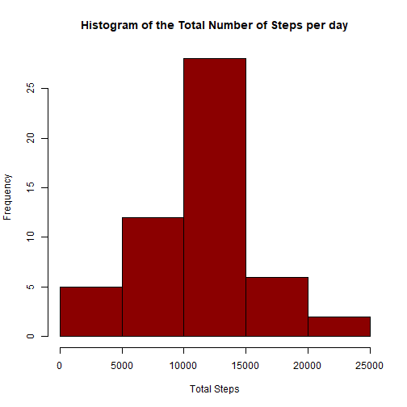
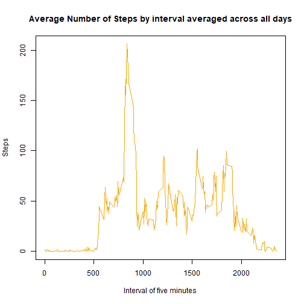
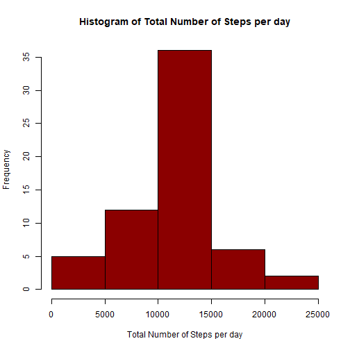
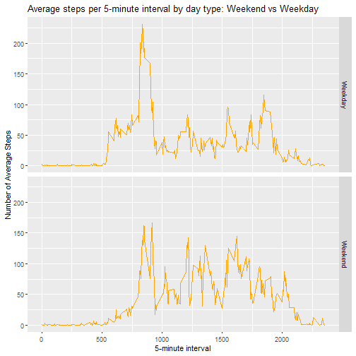

## Part 1: Loading and preprocessing the data

Download and select the data and transfom it into a suitable form for your analysis.


```r
#Path to read files
path1 <- "C:/Users/Economics05/Documents/Coursera/RR_CP1"
fileUrl1 <- "https://d396qusza40orc.cloudfront.net/repdata%2Fdata%2Factivity.zip"
filename <- "Activitymonitoringdata.zip"
download.file(fileUrl1, filename, method = "curl")
unzip(filename)

#Read the file and see the data structure
activitymonitoring <- read.csv(file.path(path1,"activity.csv"),header = TRUE)

head(activitymonitoring)
```

```
##   steps       date interval
## 1    NA 2012-10-01        0
## 2    NA 2012-10-01        5
## 3    NA 2012-10-01       10
## 4    NA 2012-10-01       15
## 5    NA 2012-10-01       20
## 6    NA 2012-10-01       25
```

```r
str(activitymonitoring)
```

```
## 'data.frame':	17568 obs. of  3 variables:
##  $ steps   : int  NA NA NA NA NA NA NA NA NA NA ...
##  $ date    : Factor w/ 61 levels "2012-10-01","2012-10-02",..: 1 1 1 1 1 1 1 1 1 1 ...
##  $ interval: int  0 5 10 15 20 25 30 35 40 45 ...
```

```r
summary(activitymonitoring)
```

```
##      steps                date          interval     
##  Min.   :  0.00   2012-10-01:  288   Min.   :   0.0  
##  1st Qu.:  0.00   2012-10-02:  288   1st Qu.: 588.8  
##  Median :  0.00   2012-10-03:  288   Median :1177.5  
##  Mean   : 37.38   2012-10-04:  288   Mean   :1177.5  
##  3rd Qu.: 12.00   2012-10-05:  288   3rd Qu.:1766.2  
##  Max.   :806.00   2012-10-06:  288   Max.   :2355.0  
##  NA's   :2304     (Other)   :15840
```

```r
names(activitymonitoring)
```

```
## [1] "steps"    "date"     "interval"
```

```r
#Transform the dates
activitymonitoring$date <- as.Date(activitymonitoring$date,"%Y-%m-%d")
```

## Part 2: What is mean total number of steps taken per day?

For this part of the assignment, you can ignore the missing values in the dataset.

1. Calculate the total number of steps taken per day

```r
library(dplyr)
library(ggplot2)
```


```r
#Total Number of Steps by day
totalsteps <- summarise(group_by(activitymonitoring,date), total=sum(steps), .groups = 'drop')
totalsteps
```

```
## # A tibble: 61 x 2
##    date       total
##    <date>     <int>
##  1 2012-10-01    NA
##  2 2012-10-02   126
##  3 2012-10-03 11352
##  4 2012-10-04 12116
##  5 2012-10-05 13294
##  6 2012-10-06 15420
##  7 2012-10-07 11015
##  8 2012-10-08    NA
##  9 2012-10-09 12811
## 10 2012-10-10  9900
## # ... with 51 more rows
```
2. If you do not understand the difference between a histogram and a barplot, research the difference between them. Make a histogram of the total number of steps taken each day

```r
#Histogram
hist(totalsteps$total, col="dark red", xlab = "Total Steps", main = "Histogram of the Total Number of Steps per day")
```



3. Calculate and report the mean and median of the total number of steps taken per day

```r
meantsperday <- mean(totalsteps$total, na.rm = TRUE)
meantsperday
```

```
## [1] 10766.19
```

```r
mediantsperday<- median(totalsteps$total, na.rm = TRUE)
mediantsperday
```

```
## [1] 10765
```
*The mean of total number of steps taken per day is 1.0766189 &times; 10<sup>4</sup>.*  
*The median of total number of steps taken per day is 10765.*

## Part 3: What is the average daily activity pattern?

1. Make a time series plot (i.e. type = "l") of the 5-minute interval (x-axis) and the average number of steps taken, averaged across all days (y-axis)  


```r
averagestepspi <- aggregate(steps~interval, data = activitymonitoring, FUN = mean, na.rm=TRUE)
plot(steps~interval, data = averagestepspi, type = "l", col= "orange", xlab= "Interval of five minutes", ylab = "Steps", main = "Average Number of Steps by interval averaged across all days")
```



2. Which 5-minute interval, on average across all the days in the dataset, contains the maximum number of steps?

```r
interval1 <- averagestepspi[which.max(averagestepspi$steps), ]$interval
```
*The interval number 835.*

## Part 4: Imputing missing values

Note that there are a number of days/intervals where there are missing values (NA). The presence of missing days may introduce bias into some calculations or summaries of the data.

1. Calculate and report the total number of missing values in the dataset (i.e. the total number of rows with NAs)


```r
totalnas <- sum(is.na(activitymonitoring$steps))
totalnas
```

```
## [1] 2304
```

*The total number of missing values in the dataset is 2304.*  


2. Devise a strategy for filling in all of the missing values in the dataset. The strategy does not need to be sophisticated. For example, you could use the mean/median for that day, or the mean for that 5-minute interval, etc.

3. Create a new dataset that is equal to the original dataset but with the missing data filled in.

*I decided to use the mean for the 5-minute interval*

```r
#calculate the mean for each 5 minute interval of the day
activitymonitoring1 <- as_tibble(activitymonitoring)
meaninterval <- summarise(group_by(activitymonitoring1,interval), total=mean(steps, na.rm = TRUE), .groups = 'drop')

newactivity <- activitymonitoring1
newactivity$steps2 <- ifelse(is.na(newactivity$steps), round(meaninterval$total[match(newactivity$interval, meaninterval$interval)],0), newactivity$steps)
#new dataset
activitynona <- select(newactivity,date,interval,steps2)
```

4. Make a histogram of the total number of steps taken each day and Calculate and report the mean and median total number of steps taken per day. Do these values differ from the estimates from the first part of the assignment? What is the impact of imputing missing data on the estimates of the total daily number of steps?


```r
#Total number of steps per day
totalstepsnona <- summarise(group_by(activitynona,date), total=sum(steps2), .groups ='drop')
totalstepsnona
```

```
## # A tibble: 61 x 2
##    date       total
##    <date>     <dbl>
##  1 2012-10-01 10762
##  2 2012-10-02   126
##  3 2012-10-03 11352
##  4 2012-10-04 12116
##  5 2012-10-05 13294
##  6 2012-10-06 15420
##  7 2012-10-07 11015
##  8 2012-10-08 10762
##  9 2012-10-09 12811
## 10 2012-10-10  9900
## # ... with 51 more rows
```

```r
hist(totalstepsnona$total, xlab = "Total Number of Steps per day", main = "Histogram of Total Number of Steps per day", col = "dark red")
```




```r
#calculate the mean and median of total number of steps taken per day
meantotalnona <- mean(totalstepsnona$total)
meantotalnona
```

```
## [1] 10765.64
```

```r
mediantotalnona <- median(totalstepsnona$total)
mediantotalnona
```

```
## [1] 10762
```

```r
#change
change1 <- (meantotalnona - meantsperday)/meantsperday
change2 <- (mediantotalnona - mediantsperday)/mediantsperday
```


*The mean of total number of steps taken per day is 1.0765639 &times; 10<sup>4</sup>.*  
*The median of total number of steps taken per day is 1.0762 &times; 10<sup>4</sup>.*

*The values obtained for the mean represent a decrease of -5.102409 &times; 10<sup>-5</sup> and for the median of -2.7868091 &times; 10<sup>-4</sup>. They do not represent a significant change in the final data displayed.*

## Part 5: Are there differences in activity patterns between weekdays and weekends?

For this part the weekdays() function may be of some help here. Use the dataset with the filled-in missing values for this part.

1. Create a new factor variable in the dataset with two levels - "weekday" and "weekend" indicating whether a given date is a weekday or weekend day.

```r
activitynona$day <- weekdays(activitynona$date)
activitynonaf <- activitynona %>% mutate(daytype = ifelse(day == "Sunday"| day == "Saturday", "Weekend", "Weekday"))
head(activitynonaf)
```

```
## # A tibble: 6 x 5
##   date       interval steps2 day    daytype
##   <date>        <int>  <dbl> <chr>  <chr>  
## 1 2012-10-01        0      2 Monday Weekday
## 2 2012-10-01        5      0 Monday Weekday
## 3 2012-10-01       10      0 Monday Weekday
## 4 2012-10-01       15      0 Monday Weekday
## 5 2012-10-01       20      0 Monday Weekday
## 6 2012-10-01       25      2 Monday Weekday
```

2. Make a panel plot containing a time series plot (i.e.type = "l") of the 5-minute interval (x-axis) and the average number of steps taken, averaged across all weekday days or weekend days (y-axis). See the README file in the GitHub repository to see an example of what this plot should look like using simulated data.


```r
#Aggregate data
activitynonaf_bydayofdate <- aggregate(steps2~interval+daytype, data = activitynonaf, FUN = mean, na.action = na.omit)

head(activitynonaf_bydayofdate)
```

```
##   interval daytype     steps2
## 1        0 Weekday 2.28888889
## 2        5 Weekday 0.40000000
## 3       10 Weekday 0.15555556
## 4       15 Weekday 0.17777778
## 5       20 Weekday 0.08888889
## 6       25 Weekday 1.57777778
```

```r
#plot
p2 <- ggplot(activitynonaf_bydayofdate, aes(interval,steps2))
p2 + geom_line(col= "orange")+xlab("5-minute interval")+ylab("Number of Average Steps")+ggtitle("Average steps per 5-minute interval by day type: Weekend vs Weekday")+ facet_grid(daytype~.)
```


